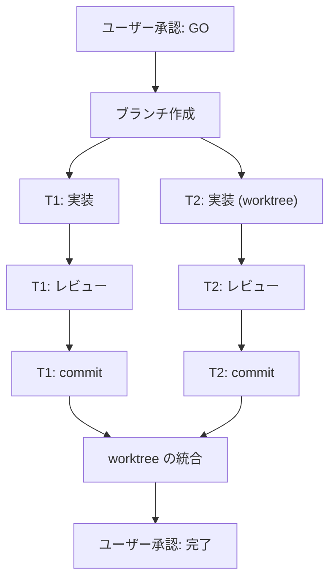

# 計画: <題>

<!--
このテンプレートを作業ディレクトリに PLAN.md として写し、各節を埋めます。
見出しは変更・削除せず、該当しない節には「該当なし」と書きます。
コメントは埋めたら削除します。
-->

## 目標

<!-- ユーザーの指示と会話から導いた目標と、合意済みの完了条件・検証方法。 -->

## 作業ディレクトリ

<!-- 絶対パス。worktree を使う場合もメインのチェックアウトのパスを書きます。 -->

## タスク一覧

<!--
タスクごとに次の見出しと項目を繰り返します。
- 内容
- 完了条件
- 担当ファイル範囲(変更してよいファイル)
- 依存・並列(依存するタスクと、並列に実行できるか)
- モデル(使うモデルと選定理由)
- 生存区間(既存のサブエージェントを使い回すか、新規コンテキストで起動するか)
-->

### T1: <タスク名>

- 内容:
- 完了条件:
- 担当ファイル範囲:
- 依存・並列:
- モデル:
- 生存区間:

## レビューとcommitの方針

<!--
各成果物のレビュー観点と、合意済みの検証をどの段階で誰が実行するか。
worktree を使う場合は、各ブランチをどの順で統合するか。統合順序は依存関係の一部です。
-->

## フローチャート

<!--
タスク一覧の依存関係の写像です。タスク、レビュー、ブランチ作成、commit、
worktree の統合、ユーザー承認を含めます。以下のノードは書き方の例です。
-->

## 確認事項

<!--
骨格が変わるものは「骨格が変わる」と明記します。
後回しにするものは、決定時期と判断材料を書きます。
-->

## 既定値

<!-- 確認事項にしなかった判断を「既定値。異議があれば差し戻し可」と付けて列挙します。 -->

## 改訂記録

<!-- 改訂ごとに、崩れた前提と観測した事実を書きます。 -->
